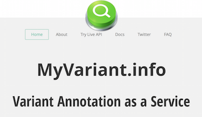

# myvariantjs

> A JS client for MyVariant.info web services

> ![Version][version]
[![NPM version][npm-image]][npm-url]
<!--
[![Build Status][travis-image]][travis-url]
[![Coveralls Status][coveralls-image]][coveralls-url]
[![Dependency Status][depstat-image]][depstat-url]
-->
[![NPM Downloads][download-badge]][npm-url]
![wow-badge][wow]
>

<br>
<table style="border:none;">
  <tr style="border:none;">
    <td style="border:none;">
      <a style="float:left;"></a>
    </td>
    <td style="border:none;">
      <a></a>
    </td>
</table>


<br>
## Demo App

You can view a basic web app [demo](http://larryhengl.github.io/myvariantjs-demo/) which uses the myvariantjs lib.

You can also clone and start the demo app locally.  Repo is [here](https://github.com/larryhengl/myvariantjs-demo).

<br>
## Intro

[MyVariant.Info](http://myvariant.info) provides simple-to-use REST web services to query/retrieve genetic variant annotation data. It is designed for simplicity and performance.

**myvariantjs** is an easy-to-use node.js client that accesses the [MyVariant.Info](http://myvariant.info) web services.

> There is also a similarly designed python client called [**myvariant.py**](https://github.com/Network-of-BioThings/myvariant.py), if python is your thing.


<br>
## Installation

```
npm install myvariantjs --save
```

<br>
## Usage
Also see the [API section](#api-sec) below.

```javascript

var mv = require("myvariant")

mv.getvariant("chr7:g.140453134T>C")

  // output below is collapsed
  {"_id": "chr7:g.140453134T>C",
   "_version": 1,
   "cadd": {...},
   "cosmic": {...},
   "dbnsfp": {...},
   "dbsnp": {...},
   "docm": {...},
   "mutdb": {...},
   "snpeff": {...},
   "vcf": {
      "alt": "C",
      "position": "140453134",
      "ref": "T"
   }}


mv.getvariant("chr7:g.140453134T>C", "cosmic,snpeff")

    {"_id": "chr7:g.140453134T>C",
     "_version": 1,
     "snpeff": {"ann": {"transcript_biotype": "Coding",
       "gene_id": "BRAF",
       "effect": "missense_variant",
       "putative_impact": "MODERATE",
       "cds": {"length": "2301", "position": "1801"},
       "feature_type": "transcript",
       "gene_name": "BRAF",
       "feature_id": "NM_004333.4",
       "hgvs_p": "p.Lys601Glu",
       "hgvs_c": "c.1801A>G",
       "rank": "15",
       "total": "18",
       "protein": {"length": "766", "position": "601"},
       "cdna": {"length": "2946", "position": "1862"}}},
     "cosmic": {"mut_freq": 0.07,
      "alt": "G",
      "mut_nt": "A>G",
      "tumor_site": "upper_aerodigestive_tract",
      "ref": "A",
      "chrom": "7",
      "hg19": {"start": 140453134, "end": 140453134},
      "cosmic_id": "COSM478"}
     }
```
<br>
> **See the [Usage Doc](docs/usage.md) for more examples.**

<br>
## API <a id="api-sec"></a>

[api](docs/api.md)

<br>
## Testing

```npm test```
> not browserified.

<br>
## Build Docs

```npm run doc```
> optional.  you can view the docs in the docs folder or on github.


<br>
## Todo
+ add more queries
+ impl export feature
+ fix tests
+ wire-up the badges for Travis, Coveralls, NPM
+ docs?

<br>
## Release History

* 0.1.0  - _Initial release_


## Contact
[@larryhengl](https://twitter.com/LarryHengl)

<br>
[![MIT license][license]](http://opensource.org/licenses/MIT) © [Larry Hengl](http://github.com/larryhengl)


[license]: http://img.shields.io/badge/license-MIT-brightgreen.svg?style=flat-square

[version]: https://img.shields.io/badge/style-1.0.0-blue.svg?style=flat-square&label=release
[wow]: https://img.shields.io/badge/style-happy-green.svg?style=flat-square&label=myvariant

[npm-url]: https://npmjs.org/package/example
[npm-image]: https://img.shields.io/npm/v/example.svg?style=flat-square

[travis-url]: https://travis-ci.org//example
[travis-image]: https://img.shields.io/travis//example.svg?style=flat-square

[coveralls-url]: https://coveralls.io/r//example
[coveralls-image]: https://img.shields.io/coveralls//example.svg?style=flat-square

[depstat-url]: https://david-dm.org//example
[depstat-image]: https://david-dm.org//example.svg?style=flat-square

[download-badge]: http://img.shields.io/npm/dm/example.svg?style=flat-square
