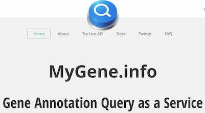

# myvariantjs

> A NodeJS client for MyVariant.info web services

> ![Version][version]
[![Node version][node-image]][node-url]
[](https://travis-ci.org/larryhengl/myvariantjs)
[](https://coveralls.io/github/larryhengl/myvariantjs?branch=master)
![myvariant-badge][myvariantjs]


<table style="border:none;">
  <tr style="border:none;">
    <td style="border:none;">
      <a style="float:left;"></a>
    </td>
    <td style="border:none;">
      <a></a>
    </td>
</table>


## Demo App

You can view a basic web app [demo](http://larryhengl.github.io/myvariantjs-demo/) which uses the myvariantjs lib.

You can also clone and start the demo app locally.  Repo is [here](https://github.com/larryhengl/myvariantjs-demo).

> Developed enterly in Chrome.  Mileage may vary in other untested browsers right now (sorry 'bout that, not enough hours in my day).

## Intro

[MyVariant.Info](http://myvariant.info) provides simple-to-use REST web services to query/retrieve genetic variant annotation data. It is designed for simplicity and performance.

**myvariantjs** is an easy-to-use node.js client that accesses the [MyVariant.Info](http://myvariant.info) web services.

> There is also a similarly designed python client called [**myvariant.py**](https://github.com/Network-of-BioThings/myvariant.py), if python is your thing.


## Installation

```
npm install myvariantjs --save
```


## Usage
Also see the [API section](#api-sec) below.

```javascript
$ node
> let mv = require('myvariantjs').default
> mv
{ url: 'http://myvariant.info/v1/',
  validFormats: [ 'json', 'csv', 'tsv', 'table', 'flat' ],
  passthru: [Function: passthru],
  getfields: [Function: getfields],
  getvariant: [Function: getvariant],
  getvariants: [Function: getvariants],
  query: [Function: query],
  querymany: [Function: querymany] }
> let got = mv.getvariant('chr9:g.107620835G>A', {fields:'dbnsfp.genename'});   //Promised
> got.then(function(res) { console.log(res) })
> { _id: 'chr9:g.107620835G>A',
  _version: 1,
  dbnsfp: { genename: 'ABCA1' } }
```


## API <a id="api-sec"></a>

[api and usage docs](docs/api.md)


## Testing

```npm test```
> not browserified.


## Build Docs

```npm run doc```
> optional.  you can view the docs in the docs folder or on github.


## Todo
+ add tests for querymany
+ add fetchall
+ add facets ?
+ add sorting
+ add 'Feelin Lucky' search => full text search, needs backend support or full query parsing


## Release History

* 1.0.0  - _Initial release_
* 1.0.1  - Add tests for query()
* 1.0.2  - api doc touchups


## Contact
[@larryhengl](https://twitter.com/LarryHengl)


[![MIT license][license]](http://opensource.org/licenses/MIT) © [Larry Hengl](http://github.com/larryhengl)

[license]: http://img.shields.io/badge/license-MIT-brightgreen.svg?style=flat-square

[version]: https://img.shields.io/badge/style-1.0.1-blue.svg?style=flat-square&label=release

[myvariantjs]: https://img.shields.io/badge/style-happy-green.svg?style=flat-square&label=myvariantjs

[node-url]: https://nodejs.org/en/

[node-image]: https://img.shields.io/badge/node-4.1.x-brightgreen.svg
